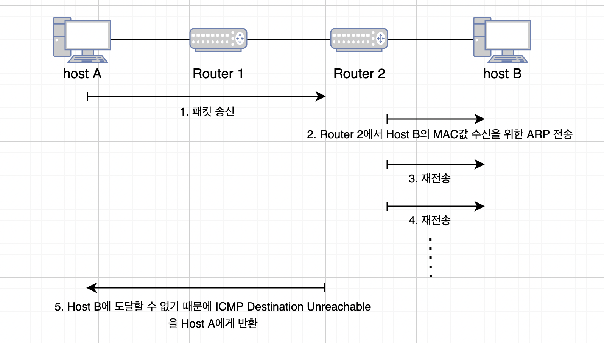

# 목차

- [목차](#목차)
- [IP](#ip)
  - [IP 주소](#ip-주소)
  - [라우팅](#라우팅)
    - [실제 라우팅 테이블 예시](#실제-라우팅-테이블-예시)
  - [IP 패킷의 분할처리와 재구축 처리](#ip-패킷의-분할처리와-재구축-처리)
    - [IP는 커넥트리스형](#ip는-커넥트리스형)
  - [IP 주소의 구조](#ip-주소의-구조)
  - [BroadCast Address](#broadcast-address)
    - [IP 멀티캐스트](#ip-멀티캐스트)
    - [서브넷 마스트 & 서브 네트워크](#서브넷-마스트--서브-네트워크)
  - [CIDR과 VLSM](#cidr과-vlsm)
    - [CIDR](#cidr)
    - [VLSM (Variable Length Subnet Mask)](#vlsm-variable-length-subnet-mask)
    - [글로벌 주소와 프라이빗 주소](#글로벌-주소와-프라이빗-주소)
  - [경로제어 (라우팅)](#경로제어-라우팅)
  - [IP의 분할 처리와 재구축 처리](#ip의-분할-처리와-재구축-처리)
  - [IPv6](#ipv6)
    - [각 아키텍저 별로 설명](#각-아키텍저-별로-설명)
    - [IPv6에서의 분할처리](#ipv6에서의-분할처리)
  - [IPv4 header](#ipv4-header)
    - [참고](#참고)
  - [IPv6 header](#ipv6-header)
  - [ARP (Address Resolution Protocal)](#arp-address-resolution-protocal)
  - [RARP (Reserve Address Resolution Protocal)](#rarp-reserve-address-resolution-protocal)
  - [ICMP (Internet Control Message Protocal)](#icmp-internet-control-message-protocal)
  - [IPv6의 ICMPv6 역할](#ipv6의-icmpv6-역할)


# IP

IP는 osi 7계층 중에서 제 3계층인 네트워크층에 해당된다. 네트워크 층의 특징은 다음과 같다. 

<center>

**종점 노드간의 통신을 실현한다.**

</center>

위와 같이 종점 노드간의 통신을 실현하기 위해서는 데이터 링크의 차이를 은폐해야 한다. 즉 다른 데이터 링크를 가진 애들과 통싱할 수 있게 한다. 

데이터 링크층과 네트워크 층의 차이는 다음과 같다. 
* 데이터 링크층: 직접 연결된 기기간의 통신을 제공
* 네트워크 층: 직접 연결되어있지 않은 네트워크 간의 전송

데이터 링크층으로 통신하지 않고 네트워크 층으로 통신하면 어떤점이 좋을까? 

<center>

```
            host A        Router A       Router B       Router C          host B
            |---------------|---------------|---------------|---------------|
                ethernet          ip-vpn          기가바이트          ATM   
                                                인터넷

                                    [데이터 링크층으로 통신하는 구조]

            host A                                                        host B
            |---------------------------------------------------------------|

                                    [네트워크 층으로 통신하는 구조] 
```
</center>

위와 같은 구조로 되어있을때 데이터 링크층으로 통신하는 구조에서는 총 4홉을 통해서 통신을 한다. 하지만 네트워크 층을 사용한다면 end-to-end 통신을 재현할 수 있다.

IP 역할
 * IP 주소
 * 종점 호스트까지의 패킷 배송 (라우팅)
 * IP 패킷의 분할처리와 재구축 처리

## IP 주소

 - IP 주소
   - 네트워크층의 식별 주소
   - 네트워크에 연결되어있는 모든 호스트 중에서 통신 상대를 식별할 때 사용.

 - MAC 주소 $\rightarrow$ 데이터 링크층의 식별자.

 - 참고 : 브리지나 스위칭 허브와 같이 물리츨이나 데이터 링크 층에서 패킷을 중계하는 기기에는 IP주소를 설정할 필요가 없다. $\rightarrow$ MAC 주소를 전달 받아서 비교후, 해당되는 MAC 주소에 전달. 


## 라우팅

 - 수신처 IP 주소를 가진 호스트까지 패킷을 전달하기 위한 기능. 


위 그림을 통해서 라우팅은 a.a.a.a IP를 가지는 A 호스트가 b.b.b.b IP를 가지는 B 호스트로 갈수 있게 해준다. 위와 같이 경로를 알 경우 **홉 바이 홉 라우팅** 아리고 한다. 

그러면 만약에 목적지는 아는데 경로를 모르면 어떻게 되는가? 
1. IP 패킷이 라우터에 도착하면, 수신처 IP 주소를 조사한다. 
2. 해당 패킷을 그 다음에 전달할 라우터를 결정하고, 그 라우터로 보낸다.
3. IP 패킷이 그 라우터에 도착하면, 다시 수신처 IP 패킷을 조사하여 그 다음 라우터로 전송한다. 

### 실제 라우팅 테이블 예시

```
 Destination          Gateway             Genmask            Flags   MSS  Window  irtt  Iface

 211.214.178.201      0.0.0.0           255.255.255.224         U    40  0         0  eth0

 127.0.0.1             0.0.0.0              255.0.0.0           U    40  0         0  lo

 0.0.0.0            211.214.178.254         0.0.0.0            UG    40  0         0  eth0
```

## IP 패킷의 분할처리와 재구축 처리

 - IP는 다른 호스트와 통신을 하기 위해서 데이터 링크를 추상화 해야 한다. $\rightarrow$ 근데 MTU는 연결방식에 따라 다른 값을 가진다. 
 - 이를 처리하기 위해 분할처리(프래그맨테이션)을 한다.


위와 같이 패킷을 분할하여 전송하게 되면 데이터 링크의 MTU와 상관없이 전송 가능
 
### IP는 커넥트리스형

 - 커넥션형: 통신하기 전에 커넥션을 확립 $\rightarrow$ 호스트의 전원이 꺼져있거나 상대 호스트가 없을 경우 연결이 확립이 안된다. 
 - 커넥션리스형: 수신처 호스트의 전원이 꺼져있거나 존재하지 않아도 패킷을 보낼 수 있음.

## IP 주소의 구조

IP 주소는 다음 두가지로 나뉘어진다. 
 - 네트워크부: 데이터 링크의 세그먼트별로 할당
 - 호스트부
예시는 다음과 같다. 


## BroadCast Address

 - 동일한 링크에 연결된 모든 호스트에게 패킷을 송신할 때 사용. 
 - IP 주소의 모든 호스트부 비트를 모두 1로 변경
   - ex. 192.168.0.7/24 $\rightarrow$ 192.168.0.255
 - 브로드케스르 주소는 다음 두가지로 나뉘어짐
   - local broadcast: 자신이 속해있는 링크 안의 브로드캐스트
   - direct broadcast: 다른 IP 네트워크에 대한 브로드캐스트

### IP 멀티캐스트
 - 패킷을 특정 그룹에 소속된 모든 호스트에게 보낼때 사용. 
 - 사용가능 IP 주소: 224.0.0.0 ~ 239.255.255.255
   - 224.0.0.0 ~ 244.0.0.255: 경로제어가 없고, 동일한 링크 안에서도 멀티 캐스트 가능
   - 나머지 주소: 전체 네트워크의 그룹 멤버에게 전달.
   - 모든 호스트: 224.0.0.1
   - 모든 라우터: 224.0.0.2

### 서브넷 마스트 & 서브 네트워크

- 서브넷 마스크: 32비트 수치, IP 주소의 네트워크 부를 나타내는 비트에 해당하는 부분은 1, 호스트부를 나타내는 비트에 대응하는 부분의 비트는 0이다. 
  - 이는 클래스에 구애받지 않고도 IP 주소의 네트워크 부를 설정 가능하다. 
- Ex. 172.20.100.52: ip, 255.255.255.192: subnet mask $\rightarrow$ 상위 26비트가 네트워크 주소. 다음 6비트가 호스트부라는 의미.
- Ex. 172.20.10.52/26

## CIDR과 VLSM 

 - 탄생 배경: 1990년대 초반까지는 클래스 단위로 IP를 할당하여 사용했다. 하지만 클래스 B의 수가 절대적으로 부족하게 되는데 이 문제를 해결하기 위해 클래스 구분을 폐지하고, 임의의 비트길이로 된 주소를 배포하게 된다. 이를 **CIDR**이라고 한다. 

### CIDR

 - CIDR: 클래스에 구애받지 않는 조직 간 경로제어. (조직간 라우팅 프로토콜인 BGP 지원)
    - BGP: 서로 다른 조직의 네트워크를 연결할 때 사용하는 프로토콜.

 - Ex. 203.183.224.1 ~ 204.183.225.254를 하나의 네트워크로 묶으면 203.183.224.0/23으로 표현 가능
 - 단점: 조직의 네트워크 안에서 서브넷 마스크의 길이를 통일해야 된다. $\rightarrow$ 효율적인 네트워크를 구축할 수 없다. 

### VLSM (Variable Length Subnet Mask)

 - VLSM: 조직내의 부서마다 서브넷 마스크의 길이를 바꿀 수 있도록 해주는 장치
 - 이는 라우팅 프로토콜 RIP2 또는 OSP 프로토콜로 변경함으로써 실현됨

### 글로벌 주소와 프라이빗 주소

 - 프라이빗 IP 주소: 인터넷과의 연결을 고려하지 않고 이용하는 주소 $\rightarrow$ 그러면 프라이빗 IP와 글로벌 IP 주소간의 주소교환을 하는 NAT 기술 등장
   - 10.0.0.0 ~ 10    255.255.255.0
   - 172.16.0.0 ~ 172.31.0.0  255.255.255.0
   - 192.168.0.0 ~ 192.168.255.255

 - 글로벌 IP 주소: 프라이빗 주소 외의 모든 주소가 글로벌 주소이다. 


## 경로제어 (라우팅)
 - 스태틱 라우팅: 라우팅 테이블을 관리자가 사전에 설정하는 방법
 - 다이나믹 라우팅: 라우터가 다른 라우터와의 정보를 교환하여 자동으로 라우팅 테이블을 작성하는 방법
   - 네트워크에 연결된 라우터끼리 라우팅 인포메이션으로 주고받을 수 있도록 라우팅 프로토콜을 확실히 정해야 한다. 
  


위 그림과 같이 구성 되어있을 경우. 호스트 A는 호스트 B와 통신이 된다. 


 - Default Route
   - 라우팅 테이블에 등록되어있는 어떤 주소와도 일치하지 않는 경우 사용하는 경로
   - 0.0.0.0/0 or default 로 기술
 - host route
   - 'IP주소/32' 
     - ex. 192.168.153.15/32
   - IP 주소의 모든 비트를 사용하여 경로 제어
   - 어떠한 이유로 네트워크 주소에 의한 경로 제어를 이용할 수 없는 경우 사용
 - 루프백 주소
   - 같은 컴퓨터 내부의 프로그램 사이에 통신을 하고싶은 경우에 이용
   - 127.0.0.1 IP 주소 이용 (localhost)

## IP의 분할 처리와 재구축 처리

* 데이터 링크에 따라 최대 전송 속도가 다르다. (MTU 값이 다르다.)
  * IP는 데이터 링크의 상위층이므로 데이터 링크의 MTU의 크기에 좌우되면 안된다. 
  * IP는 이렇게 데이터 링크 별로 다른 성질을 추상화 하는 기능이 있다. 

* Fragmentation: 네트워크에 데이터 그램을 보내려고 할 때, 그 크기대로 전송할 수 없는 경우에 진행.


* Fragmentation의 단정
  * 라우터의 처리가 무거워 진다. $\rightarrow$ 가능하면 분할처리를 안하는 것이 좋다.
  * 분할된 단편 하나를 분실했을 경우, 윈래 IP 데이터 그램이 손상된다. 

위와 같은 Fragmentation의 단점을 방지하기 위한 기술로 **경로 MTU 탐색** 기술 등장.
* 경로 MTU: 송신처 호스트에서 수신처 호스트까지 분할처리를 할 필요 없는 최대 MTU 
* 수행 순서는 다음과 같다.
  1. IP 헤더의 분할 금지 flag를 설정하여 송신한다. 라우터에서 패킷은 파기한다. 
      * 여기 경로는 10분 제한이 있다. $\rightarrow$ 10분이 지나면 다시 탐색
  2. ICMP에 의해 다음 MTU의 크기를 알게 된다. 
  3. UDP에서는 재송신 처리는 하지 않는다. 어플리케이션이 다음 메시지를 송신할 때, 분할처리가 일어난다. 
  4. 모든 단편이 모이면 IP 층에서 재구축하여 UDP층에 전달된다. 

## IPv6

* 특징
  * IP 주소의 확대와 경로 제어표 집약
  * 퍼포먼스 향상
    * 헤더 길이를 40옥텟으로 고정하고, 헤더 체크섬을 생략하는 등과 같이 헤더의 구조를 간소화
    * 헤더의 분할 처리를 시키지 않는다. $\rightarrow$ 경로 MTU 탐색을 이용하여 송신처의 호스트가 분할처리를 한다. 
  * 플러그 & 플레이를 필수로 한다. 
    * DHCP 서버가 없는 환경에서도 IP 주소를 자동으로 할당한다. 
  * 인증 기능이나 암호화 기능 채택. 
  * 멀티캐스트, Mobile IP 기능을 IPv6의 확장 기능으로 정의한다. 

* 형식
```
| -----16bit----- | -----16bit----- | -----16bit----- | -----16bit----- | -----16bit----- | -----16bit----- | 

이와 같이 총 128비트로 16비트씩 쪼개서 표현한다. 
```
* 아키텍처 
  * 미정의 : 0000:0000 ... :0000 (128bit) $\rightarrow$ ::/128
  * 퍼블릭 주소 : 000:0000 .... :0001(128bit) $\rightarrow$ ::1/128
  * 유니크 로컬 주소: 1111:1100:0000 ... : 0000 $\rightarrow$   FC00::/7
  * 링크 로컬 유니캐스트 주소: 1111:1110:10    $\rightarrow$ FE80::/10
  * 멀티캐스트 주소 : 1111:1111 $\rightarrow$ FF00::/8
  * 이외에는 모두 글로벌 유니케스트 주소이다. 
    * 글로벌 유니케스트 주소 형식: `글로벌 라우팅 주소(n-bit) || 서브넷 ID (m-bit) || 인터페이스 ID (128-n-m bit)`
    * 네트워크에서 `n=48, m=16, 128-n-m=64`를 사용

### 각 아키텍저 별로 설명

* 글로벌 유니케스트 주소 
  * 구조: `글로벌 라우팅 주소(n-bit) || 서브넷 ID (m-bit) || 인터페이스 ID (128-n-m bit)`
  * 인터페이스 ID: 64bit 판 MAC 주소를 바탕으로 한 값 추가. 단 MAC 정보는 고유정보이므로 노출시키고 싶지 않을때 임시주소로 설정 가능하다. 

* 링크 로컬 유니캐스트 주소: 동일한 데이터 링크 내에서 고유하게 정해진 구조
  * 구조: `1111111010 (10-bit)|| 0 (54-bit)|| 인터페이스 ID (64-bit)`
    * 인터페이스 ID: 보통 MAC 주소가 저장
  * 특징: 라우터를 거치지 않는 동일한 링크 내의 통신에서 사용 가능

* 유니크 로컬 주소: 인터넷과 통신하지 않는 경우 사용하는 주소
  * 구조: `1111110 (7-bit)|| 1 (1-bit)|| 글로벌 ID (40-bit)|| 서브넷 ID (16-bit)|| 인터페이스 ID (64-bit)`
    * 글로벌 ID: 난수 값

### IPv6에서의 분할처리

* 송신하는 호스트에서만 발생
* 시스템 리소스에 제한이 있는 기기에서는 경로 MTU 탐색을 제공
* 1280 옥텟 단위로 전송

## IPv4 header


* Version (4-bit) : 헤더의 버전 정보 (IPv4인 경우 4)
* IHL (4-bit) : IP 헤더 자체 크기
* TOS (8-bit) : 송신하고 있는 IP 서비스 품질
  * 0 1 2: 우선도
  * 3: 최소한 지연
  * 4: 최대한 스루풋
  * 5: 최대한 신뢰성
  * (3 ~ 6): 최대한의 보안
  * 7: 미사용
* Total Length (16-bit) : IP헤더와 IP 헤더를 더한 패킷 전체의 옥텟 전체 길이를 의미한다. 
* Identification (16-bit) : 프래그먼트를 복원할때 식별자로 사용. 
  * 동일한 프래그먼트: 동일한 값
  * 다른 프래그먼트: 다른 값
  * 보통은 패킷을 송신할 떄 마다 1씩 증가한다. 
* IP Flags (3-bit) : 패킷 분할 관련 제어 지시
  * 0: 미사용
  * 1: 분할 가능한지 아닌지 확인 (0: 가능, 1: 불가능)
  * 2: 마지막 패킷인지 아닌지 확인 (0: final, 1: middle)
* Fragment Offset (13-bit) : 분할된 프래그먼트가 오리지널에서 몇번째 위치였는지에 대한 정보
* Time To Live (TTL) (8-bit) : 이 패킷이 네트워크에 존재해도 좋은 시간 (딘위: 초)
* protocal (8-bit) : 헤더의 어떤 프로토콜을 사용하는지
* Header Checksum (16-bit) : IP 헤더의 체크섬
  * Checksum: 헤더가 손상되지 않았음을 보증
* Source Address (32-bit) : 송신처 IP 주소
* Destination Address (32-bit) : 수신처 IP 주소
* IP Option (0 ~ 40-bit) 
  * 가변길이를 가진다.
  * 일반적으로 옵션 필드를 사용하지 않지만, 테스트나 디버그 등을 할때 사용한다. 
* Data (0 ~ 40-bit) : TCP or UDP or ICMP 등 프로토콜 헤더나 데이터가 붙음 

### 참고

* 현재 TOS를 DSCP 필드나 ECN 필드로 재정의 하자는 제안 출현
  * DSCP 필드 (Differentiated Service CodePoint): TOS로 정의되어있는 부분을 의미한다. 현재는 DiffServ라는 품질제어에서 이용
  * ENC 필드 (Explict congestion Notification): 네트워크가 혼잡하다는 것을 통지하기위한 코드
    * 6 번째 비트를 ECT 라고 하고 이는 ENC-Capable Transport 를 의미한다.
    * 7 번째 비트를 CE 라고 하고 이는 Congestion Experienced를 의미한다. 

결국 제안하는 구조는 다음과 같다. 
```
                      | -------------- | ------- |
                          DSCP 필드      ENC 필드
```

## IPv6 header


* Version (4-bit): 버전명 (IPv6은 6)
* Traffic class (8-bit): IPv4의 TOS에 해당하는 필드.
* Flow label (20-bit) : 품질제어로 이용하는 것을 고려중인 필드
  * Flow label을 이용하고 싶은 경우 모두 0으로 채워야함.
  * 품질제어 할 경우: Flow label을 난수로 결정, RSVP 와 같은 플로우를 셋업하는 프로토콜을 이용하여 경로상의 라우터에 품질제어에 관한 설정을 해야 함.
* Payload length (16-bit): 패킷의 데이터 부분 크기를 의미
  * IPv4와 다르게 헤더를 제외하고 고려
* Next header (8-bit): IPv4의 프로토콜 필드, IPv6의 확장헤더가 있는 경우 그 프로토콜 번호가 들어가 있음
* Hop limit (8-bit): 통과할수 있는 라우터의 수 제한
* Source Address (128-bit): 송신처 IP 주소
* Destination Address (128-bit): 수신처 IP 주소

IPv6는 고정레더로 옵션을 헤더 안에 넣을 수 없다. 이를 확장 헤더를 사용하여 넣는다. 


## ARP (Address Resolution Protocal)

 * ARP: 주소 해결을 위한 프로토콜
   * 수신처 IP 주소를 단서로 다음에 패킷을 받아야할 기기의 MAC 주소를 알고 싶을때 사용.
   * IPv4에서만 사용 (IPv6는 ICMPv6의 인접 탐색 메시지를 사용)

ARP 에서는 다음 두개의 패킷을 사용한다. 
* ARP 요청 패킷: MAC 주소를 알아내기 위해 송신하는 패킷
* ARP 응답 패킷: MAC 주소를 알려주기 위한 패킷


1. ARP 요청 패킷을 브로드캐스트 한다. 
2. 목적하는 IP 주소가 자신의 IP 주소인 경우 자신의 MAC 주소를 넣고 응답 패킷을 전송한다. 

이러한 주소 해결은 동적으로 이루어진다. $\rightarrow$ TCP/IP로 네트워크를 구축하거나 통신할때 MAC 주소를 의식할 필요가 없다. 
 * ARP 로 획득한 MAC 주소는 몇분간 캐시된다.
   * IP 데이터그램 하나 보낼때 마다 ARP프로토콜을 사용하면 너무 많은 패킷이 발생하기 때문이다. 
 * ARP 요청 패킷에는 요펑한 호스트의 IP와 MAC 값이 있다.
   * 이 또한 요청 받은 호스트에서 MAC 값이 캐시된다. 


## RARP (Reserve Address Resolution Protocal)

 * RARP: MAC 주소로 부터 IP를 알고힢은 경우 사용하는 프로토콜


위 그림에서 알수 있듯이 RARP에 클라이언트에 대한 (MAC, IP)가 저장되어있다. 이를 클라이언트가 요청하면 서버가 응답해준다. 

## ICMP (Internet Control Message Protocal)

 * ICMP: IP 패킷이 목적하는 호스트까지 도착했는지 확인 가능하다. 
   * 어떤 원인으로 IP 패킷이 파기되었을때에 해당 원인을 통지해주는 기능을 가지고 있다.
   * 불충분한 설정을 보다 좋은 설정으로 변경해주는 기능



* ICMP 리다이렉트 메시지
  * 송신측 호스트가 최적이 아닌 경로를 사용하고 있다는 사실을 라우터가 발견했을 때, ICMP 리다이렉트 메시지를 그 호스트에 대해 보낸다.
  * 해당 메시지는 최적 경로에 대한 정보와 원래의 데이터 그램이 들어있다. 
  * **패킷이 라우터로 들어오는 인터페이스는 패킷이 라우팅되는 인터페이스와 동일**

## IPv6의 ICMPv6 역할

* 기존 IPv4의 ICMP는 보조하는 역할이여서 ICMP가 없어도 통신이 가능했다. 하지만 IPv6는 ICMPv6가 없으면 통신이 안된다.
* 특히 IP 주소로부터 MAC을 조사하는 프로토콜이 IPv6에서 ARP에서 ICMP의 인접탐색 메시지로 변경되었다. 
  * ICMP의 인접탐색 메시지: IPv4의 ARP + ICMP direct + ICMP Router select message
  * 이는 IP 주소를 자동으로 설정하는 기능이 존재한다. 

* 인접 탐색 과정
  1. 