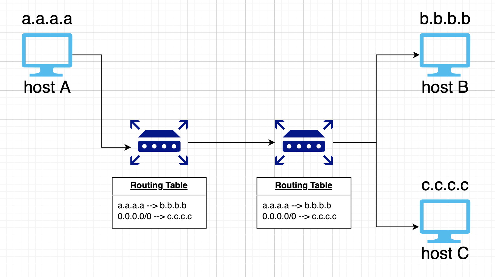
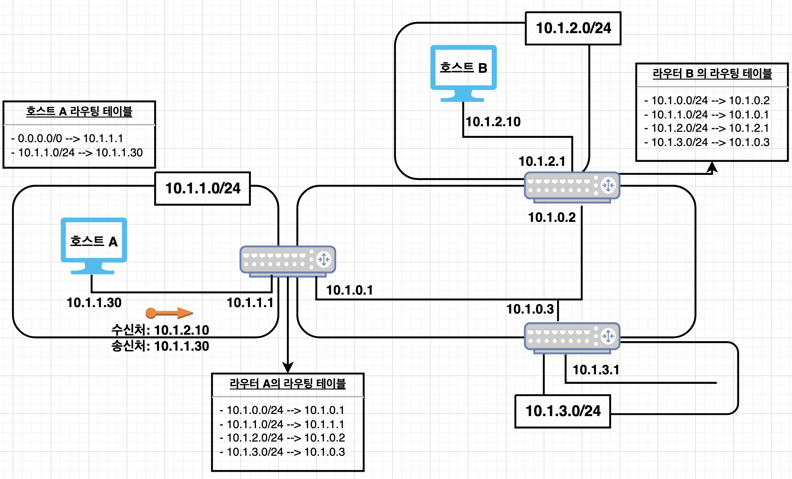

# IP

IP는 osi 7계층 중에서 제 3계층인 네트워크층에 해당된다. 네트워크 층의 특징은 다음과 같다. 

<center>

**종점 노드간의 통신을 실현한다.**

</center>

위와 같이 종점 노드간의 통신을 실현하기 위해서는 데이터 링크의 차이를 은폐해야 한다. 즉 다른 데이터 링크를 가진 애들과 통싱할 수 있게 한다. 

데이터 링크층과 네트워크 층의 차이는 다음과 같다. 
* 데이터 링크층: 직접 연결된 기기간의 통신을 제공
* 네트워크 층: 직접 연결되어있지 않은 네트워크 간의 전송

데이터 링크층으로 통신하지 않고 네트워크 층으로 통신하면 어떤점이 좋을까? 

<center>

```
            host A        Router A       Router B       Router C          host B
            |---------------|---------------|---------------|---------------|
                ethernet          ip-vpn          기가바이트          ATM   
                                                인터넷

                                    [데이터 링크층으로 통신하는 구조]

            host A                                                        host B
            |---------------------------------------------------------------|

                                    [네트워크 층으로 통신하는 구조] 
```
</center>

위와 같은 구조로 되어있을때 데이터 링크층으로 통신하는 구조에서는 총 4홉을 통해서 통신을 한다. 하지만 네트워크 층을 사용한다면 end-to-end 통신을 재현할 수 있다.

IP 역할
 * IP 주소
 * 종점 호스트까지의 패킷 배송 (라우팅)
 * IP 패킷의 분할처리와 재구축 처리

## IP 주소

 - IP 주소
   - 네트워크층의 식별 주소
   - 네트워크에 연결되어있는 모든 호스트 중에서 통신 상대를 식별할 때 사용.

 - MAC 주소 $\rightarrow$ 데이터 링크층의 식별자.

 - 참고 : 브리지나 스위칭 허브와 같이 물리츨이나 데이터 링크 층에서 패킷을 중계하는 기기에는 IP주소를 설정할 필요가 없다. $\rightarrow$ MAC 주소를 전달 받아서 비교후, 해당되는 MAC 주소에 전달. 


## 라우팅

 - 수신처 IP 주소를 가진 호스트까지 패킷을 전달하기 위한 기능. 



위 그림을 통해서 라우팅은 a.a.a.a IP를 가지는 A 호스트가 b.b.b.b IP를 가지는 B 호스트로 갈수 있게 해준다. 위와 같이 경로를 알 경우 **홉 바이 홉 라우팅** 아리고 한다. 

그러면 만약에 목적지는 아는데 경로를 모르면 어떻게 되는가? 
1. IP 패킷이 라우터에 도착하면, 수신처 IP 주소를 조사한다. 
2. 해당 패킷을 그 다음에 전달할 라우터를 결정하고, 그 라우터로 보낸다.
3. IP 패킷이 그 라우터에 도착하면, 다시 수신처 IP 패킷을 조사하여 그 다음 라우터로 전송한다. 

### 실제 라우팅 테이블 예시

```
 Destination          Gateway             Genmask            Flags   MSS  Window  irtt  Iface

 211.214.178.201      0.0.0.0           255.255.255.224         U    40  0         0  eth0

 127.0.0.1             0.0.0.0              255.0.0.0           U    40  0         0  lo

 0.0.0.0            211.214.178.254         0.0.0.0            UG    40  0         0  eth0
```

## IP 패킷의 분할처리와 재구축 처리

 - IP는 다른 호스트와 통신을 하기 위해서 데이터 링크를 추상화 해야 한다. $\rightarrow$ 근데 MTU는 연결방식에 따라 다른 값을 가진다. 
 - 이를 처리하기 위해 분할처리(프래그맨테이션)을 한다.


위와 같이 패킷을 분할하여 전송하게 되면 데이터 링크의 MTU와 상관없이 전송 가능
 
### IP는 커넥트리스형

 - 커넥션형: 통신하기 전에 커넥션을 확립 $\rightarrow$ 호스트의 전원이 꺼져있거나 상대 호스트가 없을 경우 연결이 확립이 안된다. 
 - 커넥션리스형: 수신처 호스트의 전원이 꺼져있거나 존재하지 않아도 패킷을 보낼 수 있음.

## IP 주소의 구조

IP 주소는 다음 두가지로 나뉘어진다. 
 - 네트워크부: 데이터 링크의 세그먼트별로 할당
 - 호스트부
예시는 다음과 같다. 


## BroadCast Address

 - 동일한 링크에 연결된 모든 호스트에게 패킷을 송신할 때 사용. 
 - IP 주소의 모든 호스트부 비트를 모두 1로 변경
   - ex. 192.168.0.7/24 $\rightarrow$ 192.168.0.255
 - 브로드케스르 주소는 다음 두가지로 나뉘어짐
   - local broadcast: 자신이 속해있는 링크 안의 브로드캐스트
   - direct broadcast: 다른 IP 네트워크에 대한 브로드캐스트

### IP 멀티캐스트
 - 패킷을 특정 그룹에 소속된 모든 호스트에게 보낼때 사용. 
 - 사용가능 IP 주소: 224.0.0.0 ~ 239.255.255.255
   - 224.0.0.0 ~ 244.0.0.255: 경로제어가 없고, 동일한 링크 안에서도 멀티 캐스트 가능
   - 나머지 주소: 전체 네트워크의 그룹 멤버에게 전달.
   - 모든 호스트: 224.0.0.1
   - 모든 라우터: 224.0.0.2

### 서브넷 마스트 & 서브 네트워크

- 서브넷 마스크: 32비트 수치, IP 주소의 네트워크 부를 나타내는 비트에 해당하는 부분은 1, 호스트부를 나타내는 비트에 대응하는 부분의 비트는 0이다. 
  - 이는 클래스에 구애받지 않고도 IP 주소의 네트워크 부를 설정 가능하다. 
- Ex. 172.20.100.52: ip, 255.255.255.192: subnet mask $\rightarrow$ 상위 26비트가 네트워크 주소. 다음 6비트가 호스트부라는 의미.
- Ex. 172.20.10.52/26

## CIDR과 VLSM 

 - 탄생 배경: 1990년대 초반까지는 클래스 단위로 IP를 할당하여 사용했다. 하지만 클래스 B의 수가 절대적으로 부족하게 되는데 이 문제를 해결하기 위해 클래스 구분을 폐지하고, 임의의 비트길이로 된 주소를 배포하게 된다. 이를 **CIDR**이라고 한다. 

### CIDR

 - CIDR: 클래스에 구애받지 않는 조직 간 경로제어. (조직간 라우팅 프로토콜인 BGP 지원)
    - BGP: 서로 다른 조직의 네트워크를 연결할 때 사용하는 프로토콜.

 - Ex. 203.183.224.1 ~ 204.183.225.254를 하나의 네트워크로 묶으면 203.183.224.0/23으로 표현 가능
 - 단점: 조직의 네트워크 안에서 서브넷 마스크의 길이를 통일해야 된다. $\rightarrow$ 효율적인 네트워크를 구축할 수 없다. 

### VLSM (Variable Length Subnet Mask)

 - VLSM: 조직내의 부서마다 서브넷 마스크의 길이를 바꿀 수 있도록 해주는 장치
 - 이는 라우팅 프로토콜 RIP2 또는 OSP 프로토콜로 변경함으로써 실현됨

### 글로벌 주소와 프라이빗 주소

 - 프라이빗 IP 주소: 인터넷과의 연결을 고려하지 않고 이용하는 주소 $\rightarrow$ 그러면 프라이빗 IP와 글로벌 IP 주소간의 주소교환을 하는 NAT 기술 등장
   - 10.0.0.0 ~ 10    255.255.255.0
   - 172.16.0.0 ~ 172.31.0.0  255.255.255.0
   - 192.168.0.0 ~ 192.168.255.255

 - 글로벌 IP 주소: 프라이빗 주소 외의 모든 주소가 글로벌 주소이다. 


## 경로제어 (라우팅)
 - 스태틱 라우팅: 라우팅 테이블을 관리자가 사전에 설정하는 방법
 - 다이나믹 라우팅: 라우터가 다른 라우터와의 정보를 교환하여 자동으로 라우팅 테이블을 작성하는 방법
   - 네트워크에 연결된 라우터끼리 라우팅 인포메이션으로 주고받을 수 있도록 라우팅 프로토콜을 확실히 정해야 한다. 
  


위 그림과 같이 구성 되어있을 경우. 호스트 A는 호스트 B와 통신이 된다. 


 - Default Route
   - 라우팅 테이블에 등록되어있는 어떤 주소와도 일치하지 않는 경우 사용하는 경로
   - 0.0.0.0/0 or default 로 기술
 - host route
   - 'IP주소/32' 
     - ex. 192.168.153.15/32
   - IP 주소의 모든 비트를 사용하여 경로 제어
   - 어떠한 이유로 네트워크 주소에 의한 경로 제어를 이용할 수 없는 경우 사용
 - 루프백 주소
   - 같은 컴퓨터 내부의 프로그램 사이에 통신을 하고싶은 경우에 이용
   - 127.0.0.1 IP 주소 이용 (localhost)
